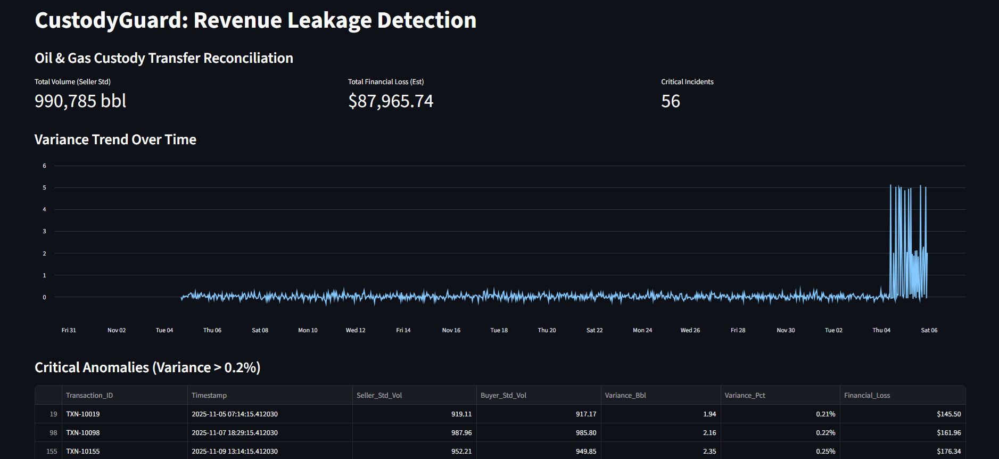

# custody guard
Система фин. контроля для Midstream, предотвращающая потерю выручки (Revenue Leakage) путем сверки объемов нефти по международным стандартам API MPMS

# 🛡️ CustodyGuard: Automated Reconciliation Engine

> **FinTech-решение для нефтегазовой отрасли (Midstream).**
> *Предотвращаем потерю выручки (Revenue Leakage) при коммерческой передаче нефти.*

---

## 📉 Проблема (The Pain)

В секторе Midstream (транспортировка) нефть постоянно меняет владельца: Скважина → Трубопровод → Танкер → НПЗ. Этот процесс называется **Custody Transfer**.

Даже небольшая разница в температуре (на 10°F) меняет объем жидкости на ~0.5%. При объемах в 1 млн баррелей это приводит к "фантомным потерям" или переплатам в **$30,000 - $50,000 за одну операцию**.
Традиционная сверка (Reconciliation) делается вручную в Excel, что долго и не позволяет ловить ошибки в реальном времени.

## 💡 Решение (The Solution)

**CustodyGuard** — это алгоритмический аудитор, который работает как "Цифровой Двойник" процесса передачи.

Он автоматически нормализует объемы продавца и покупателя к стандартным условиям (60°F / 15°C), используя логику стандартов **API MPMS (Manual of Petroleum Measurement Standards)**, и подсвечивает финансовые риски.

---

## 🚀 Ключевой Функционал (Key Features)

* **VCF Normalization Engine:** Автоматический пересчет наблюдаемого объема (Observed Volume) в стандартный (Standard Volume) с учетом коэффициентов термического расширения.
* **Anomaly Detection:** Алгоритм выявляет подозрительные транзакции, где дисбаланс превышает допустимый порог (например, 0.2%).
* **Financial Exposure Calculator:** Мгновенный перевод физических потерь (баррели) в финансовые (доллары USD).
* **Audit Trail:** Визуализация расхождений во времени для выявления системных сбоев оборудования (Meter Drift) или хищений.

---

## 📊 Демонстрация работы (How it works)

Система симулирует поток данных с двух узлов учета (Metering Skids):
1.  **Seller (Продавец):** Отгружает горячую нефть (95°F).
2.  **Buyer (Покупатель):** Принимает остывшую нефть (60°F).

### Бизнес-логика (Пример):
| Параметр | Показания Продавца | Показания Покупателя | Вердикт системы |
| :--- | :--- | :--- | :--- |
| **Observed Vol** | 1,000 bbl | 982 bbl | ❌ Кажется, что потеряли 18 bbl |
| **Temp** | 95°F | 60°F | |
| **Standard Vol (60°F)** | **982.5 bbl** | **982.0 bbl** | ✅ **Разница всего 0.5 bbl (OK)** |

---

## 🛠 Технический стек

* **Core:** Python 3.9
* **Data Processing:** Pandas (Financial modeling & Time-series analysis)
* **Frontend:** Streamlit (Interactive Dashboard)
* **Standards:** Логика основана на упрощенных формулах API MPMS Chapter 11.1 (Volume Correction Factors).

---

## 💰 Юнит-экономика и Вэлью

Внедрение CustodyGuard на узле с оборотом 100,000 баррелей/сутки:
* **Сокращение времени сверки:** с 4 часов до 5 секунд (автоматизация).
* **Предотвращение потерь:** Выявление "Meter Drift" (сбоя счетчика) на ранней стадии экономит до **$500k в год**.

---

## 📦 Как запустить локально

1. Клонируйте репозиторий:
git clone [https://github.com/pogos-akopian/custody_guard.git](https://github.com/pogos-akopian/custody_guard.git)

2. Установите зависимости:
pip install -r requirements.txt

3. Сгенерируйте данные (симуляция):
python generate_data.py

4. Запустите дашборд:
streamlit run app.py

___
Project by Pogos Akopian. Created as a proof-of-concept for Energy FinTech solutions.
